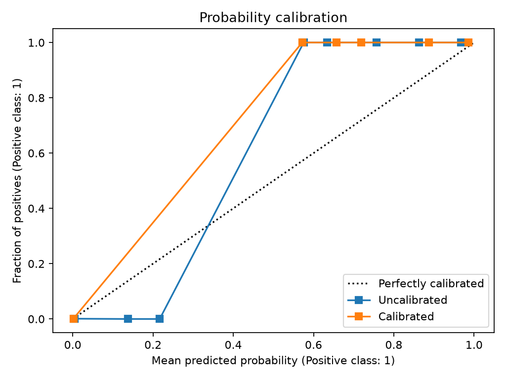
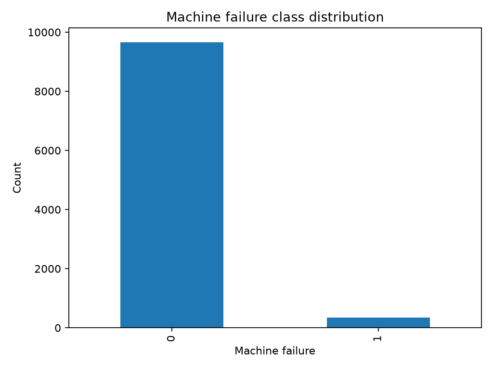

# AM2-01 — Predictive Maintenance Benchmark

A comparative machine-learning project for predictive maintenance using the **UCI AI4I 2020 Predictive Maintenance Dataset**.

This repository demonstrates an end-to-end supervised AI-engineering workflow: reproducible data acquisition, EDA, comparative modelling, cross-validation, probability calibration, threshold/cost analysis, explainability, robustness, experiment tracking, CI and deployment design.

## Project question

> How reliably can machine-learning models identify machine-failure risk from operational measurements, and how do simple interpretable models compare with more flexible ensemble models?

## Experiment status

- ✅ CI passing
- ✅ End-to-end experiment executed in GitHub Actions
- ✅ Real metrics committed under `evidence/`
- ✅ Calibration, thresholding, explainability and robustness evaluated
- ✅ Model card and MLOps design documented

## Key results

| Result | Value |
|---|---:|
| Reference model | Random Forest |
| 5-fold CV average precision | **0.9761 ± 0.0050** |
| Calibrated average precision | **0.9784** |
| Uncalibrated Brier score | 0.0018 |
| Calibrated Brier score | **0.0013** |
| Selected decision threshold | **0.05** |
| False-negative / false-positive cost | **10 : 1** |
| Repeated-split average precision | **0.9706 ± 0.0110** |

### Calibration



The calibrated Random Forest reduced the Brier score from **0.0018 to 0.0013** while maintaining strong average precision. This matters because the model is intended to support a probability-based maintenance decision rather than only produce a hard class label.

### Class imbalance



Because machine failure is rare, **accuracy is not the primary selection metric**. The project therefore emphasises average precision, recall, calibration and cost-sensitive thresholding.

## What the experiment shows

The Random Forest provided the strongest reference performance in the executed benchmark. Calibration improved probability quality, and a threshold of **0.05** was selected under an asymmetric cost policy where a missed failure was treated as ten times more costly than a false alarm.

Permutation importance identified the strongest signals as:

1. `hdf`
2. `twf`
3. `osf`
4. `pwf`
5. `tool_wear`

The repeated-split average precision of **0.9706** shows that the result remained strong across multiple random splits, although the underlying dataset is synthetic and should not be treated as evidence of live industrial performance.

## Dataset

Source: UCI Machine Learning Repository — AI4I 2020 Predictive Maintenance Dataset.

- 10,000 observations
- synthetic predictive-maintenance data
- target: `Machine failure`
- predictors include temperatures, rotational speed, torque, tool wear and product type
- DOI: `10.24432/C5HS5C`

The raw dataset is downloaded reproducibly and is not committed.

## Model benchmark

- Dummy classifier
- Logistic regression
- Random forest
- Gradient boosting

## Evaluation strategy

- precision, recall and F1
- ROC-AUC
- average precision
- Brier score
- stratified 5-fold cross-validation
- probability calibration
- threshold/cost analysis
- permutation importance
- repeated-split robustness checks

## Reproduce the experiment

```bash
python -m venv .venv
.venv\Scripts\activate
python -m pip install --upgrade pip
pip install -e ".[dev]"

python scripts/download_data.py
python scripts/run_eda.py
python scripts/train_baseline.py
python scripts/benchmark_cv.py
python scripts/run_phase3_analysis.py
python scripts/finalise_project.py
pytest
```

The manual **Run real experiment** GitHub Actions workflow executes the full pipeline and commits a compact evidence pack.

## Evidence

- [Full experiment summary](evidence/RESULTS.md)
- [Final machine-readable summary](evidence/final_project_summary.json)
- [Evidence tables](evidence/tables/)
- [Evidence figures](evidence/figures/)
- [How to run the real experiment](docs/running_real_experiment.md)

## Documentation

- `docs/dataset.md`
- `docs/methodology.md`
- `docs/phase2_eda_benchmarking.md`
- `docs/phase3_calibration_explainability.md`
- `docs/model_card.md`
- `docs/deployment_mlops.md`
- `docs/final_summary.md`
- `docs/final_reflection.md`
- `docs/am2_evidence.md`

## Responsible use

This project is educational and experimental. The dataset is synthetic, so the measured performance must not be interpreted as evidence of deployment performance on real machinery.

## Licence

Code: MIT License. Dataset: see the UCI dataset page and its stated licence/citation requirements.
